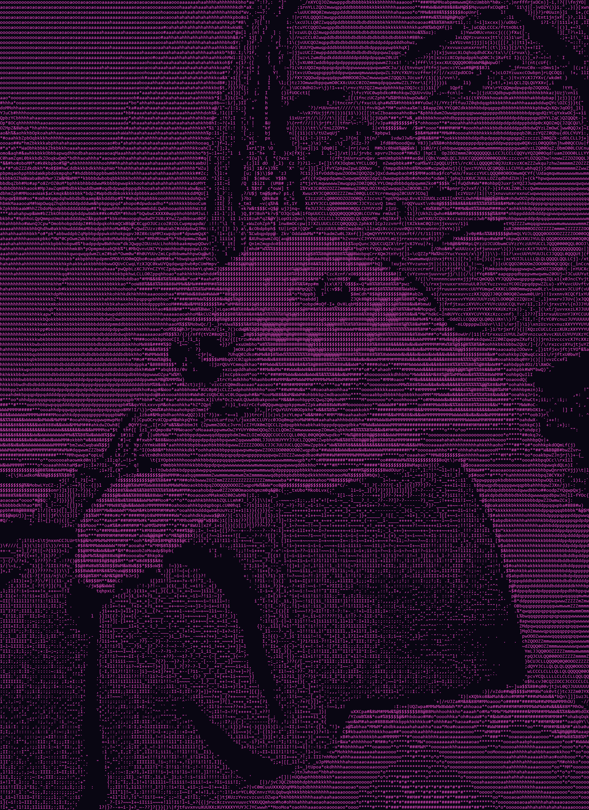

# High-Detail ASCII Image Converter

Turn ordinary photographs and illustrations into high-resolution images drawn
entirely with ASCII characters.

The converter studies the brightness, contrast, edges, shadows, and optional
colors in the source image. It then assigns a character to each sampled area and
renders the result as a normal PNG, JPEG, or WebP image. The finished artwork is
saved to disk and is not printed in the terminal.



## Features

- A 68-character density ramp for smooth shading and fine tonal differences
- Floyd-Steinberg, ordered, or disabled dithering
- Automatic aspect-ratio correction for monospace characters
- Shadow recovery with adjustable gamma and black-point controls
- Local sharpening and edge enhancement
- Extra edge preservation between colors with similar brightness
- White-on-black and inverted black-on-white output
- A uniform custom glyph color using names or hex values
- Optional source-image colors for every glyph
- Custom background colors
- Adjustable output resolution and glyph size
- Automatic EXIF orientation correction
- PNG, JPEG, WebP, and other Pillow-supported input formats
- Safe input-overwrite protection and readable error messages
- No terminal artwork output; the result is always saved as an image

## Requirements

- Python 3.10 or newer
- Pillow 10.0 or newer

Install Pillow with:

```powershell
python -m pip install -r requirements.txt
```

You can also install it directly:

```powershell
python -m pip install Pillow
```

## Quick Start

Convert an image using the high-quality defaults:

```powershell
python ascii_image.py photo.jpg
```

The result is saved beside the source image as:

```text
photo_ascii.png
```

Choose a specific destination:

```powershell
python ascii_image.py photo.jpg --output converted.png
```

The converter does not print the artwork or a success message. If the command
finishes without an error, check the requested output path.

## Color Examples

### One color for all glyphs

Use a standard color name:

```powershell
python ascii_image.py photo.jpg --ink-color cyan --output cyan_ascii.png
```

Or use a hexadecimal RGB color:

```powershell
python ascii_image.py photo.jpg --ink-color "#39FF14" --output neon_ascii.png
```

### Custom glyph and background colors

```powershell
python ascii_image.py photo.jpg `
  --ink-color gold `
  --background-color "#181225" `
  --output gold_ascii.png
```

### Preserve the source colors

```powershell
python ascii_image.py photo.jpg --color --output colored_ascii.png
```

`--color` assigns each glyph the color of its corresponding source pixel.
`--color` and `--ink-color` cannot be used together because they represent two
different coloring modes.

## Quality Examples

The defaults are tuned for detailed photographs and currently use 220 character
columns, gamma `0.78`, detail strength `1.35`, edge boost `0.24`, and
Floyd-Steinberg dithering.

Use more character columns when the source contains small facial features,
textures, or lettering:

```powershell
python ascii_image.py portrait.jpg --width 300 --output detailed_portrait.png
```

Use fewer columns for a smaller file and faster conversion:

```powershell
python ascii_image.py portrait.jpg --width 120 --output small_portrait.png
```

Reveal additional shadow detail:

```powershell
python ascii_image.py dark_photo.jpg `
  --gamma 0.68 `
  --black-point 0.02 `
  --output shadow_detail.png
```

Create a stronger, more graphic result:

```powershell
python ascii_image.py photo.jpg `
  --contrast 1.3 `
  --detail 1.5 `
  --style compact `
  --output graphic_ascii.png
```

## Command-Line Options

| Option | Purpose | Default |
| --- | --- | --- |
| `image` | Source image path | Required |
| `-o`, `--output PATH` | Destination PNG, JPEG, or WebP path | `IMAGE_ascii.png` |
| `-w`, `--width N` | Number of character columns | `220` |
| `--height N` | Forces a specific number of character rows | Automatic |
| `--cell-aspect N` | Corrects for character-cell proportions | `0.48` |
| `--font-size N` | Glyph size in the rendered image | `14` |
| `--contrast N` | Global contrast multiplier | `1.12` |
| `--gamma N` | Below 1 reveals shadows; above 1 deepens them | `0.78` |
| `--black-point N` | Brightness fraction treated as pure black | `0.05` |
| `--detail N` | Local sharpening strength | `1.35` |
| `--edge-boost N` | Preserves similarly bright color boundaries | `0.24` |
| `--autocontrast` | Expands a flat image's tonal range | Off |
| `--invert` | Uses dark glyphs on a light background | Off |
| `--dither MODE` | `floyd`, `ordered`, or `none` | `floyd` |
| `--style STYLE` | `texture` or `compact` character ramp | `texture` |
| `--color` | Uses source-pixel colors for glyphs | Off |
| `--ink-color COLOR` | Uses one named or hex glyph color | White |
| `--background-color COLOR` | Selects a named or hex background color | Black |

Run the built-in help for the current list:

```powershell
python ascii_image.py --help
```

## How It Works

The conversion pipeline has several stages:

1. The source image is opened, EXIF orientation is applied, and transparency is
   composited onto a black working canvas.
2. The image is resized to the requested number of character cells. Its height
   is corrected because a monospace character is usually taller than it is wide.
3. An RGB copy is retained for source-color rendering and color-edge detection.
4. A grayscale copy is created for brightness analysis.
5. Optional autocontrast, local sharpening, and color-edge recovery enhance
   details that could otherwise disappear during reduction.
6. Contrast, black point, and gamma adjustments shape the shadow and highlight
   distribution.
7. Dithering distributes quantization error so gradients do not collapse into
   obvious bands.
8. Each brightness level is mapped to one of 68 characters, progressing from a
   blank space to visually dense characters such as `@` and `$`.
9. Pillow draws those characters with a monospace font and saves the finished
   artwork as a normal image file.

## Character Styles

The default `texture` style uses a long ramp containing punctuation, brackets,
letters, numbers, and dense symbols. It produces the varied shadow work seen in
traditional detailed ASCII art.

The `compact` style uses the shorter ramp:

```text
 .:-=+*#%@
```

The compact ramp creates a simpler and more poster-like result, but it cannot
represent as many subtle brightness differences.

## Practical Observations

During development and testing, I made several useful observations:

- Resolution matters more than simply adding more symbols. A long character ramp
  improves shading, but small features still require enough character cells.
- Monospace characters are not square. Without aspect correction, faces and
  objects appear stretched vertically.
- A short density ramp causes smooth shadows to become visible bands. The
  68-level ramp preserves much more of the original tonal variation.
- Dithering is especially helpful in skin, sky, fabric, and other gradual
  surfaces. Floyd-Steinberg generally looks the most natural, while ordered
  dithering produces a deliberately retro pattern.
- Brightness alone cannot distinguish two colors with the same luminance. A small
  RGB edge boost helps preserve boundaries such as green against blue or hair
  against similarly bright surroundings.
- Aggressive sharpening can turn sensor noise into stray punctuation. Masking
  enhancement below the black point keeps dark backgrounds cleaner.
- Increasing width improves structural detail, but very small printed text may
  still become unreadable because this is tonal conversion rather than OCR.
- The appearance of a glyph ramp depends partly on the selected font. A character
  that looks dense in one font can be lighter in another.
- Photographs with a clear subject, useful contrast, and visible edge separation
  usually produce the strongest results.

## What I Learned

Through this project, I learned that image-to-ASCII conversion is more than
replacing grayscale pixels with characters. The quality depends on treating the
characters as tiny visual shapes with different amounts of ink.

I learned how gamma, black-point adjustment, contrast, and dithering affect
different parts of an image. Lowering gamma can reveal a face in shadow, but too
much adjustment can flatten highlights. Raising the black point cleans a dark
background, but raising it too far removes legitimate shadow information.

I also learned why resizing must account for the proportions of a character
cell. Standard image resizing preserves pixel geometry, while ASCII artwork must
preserve glyph geometry. Correcting this difference made the output look much
closer to the source.

Another important lesson was that color information can help even when the final
artwork is monochrome. Edge detection in RGB space can preserve a boundary that
would disappear in grayscale. This was useful for subjects whose colors were
different but whose brightness values were similar.

Finally, I learned the value of regression testing for creative software. Visual
quality is subjective, but tests can still guarantee important behavior: every
character level is reachable, dithering stays in range, transparent images work,
invalid files fail cleanly, output images are created, user colors are parsed,
and source files cannot be overwritten accidentally.

## Limitations

- Fine text in a source image may not remain readable at ordinary widths.
- The built-in density ramp is approximate because fonts render differently.
- A very bright background can become visually busy in white-on-black mode.
- Source-color output may make dark glyphs difficult to see on a dark background.
- The converter does not currently crop, remove backgrounds, or isolate subjects.
- Very large widths create large output files and take longer to render.
- The automatic font selection may produce slightly different results across
  Windows, macOS, and Linux.

## Future Improvements

Ideas I would like to explore next include:

- A desktop interface with drag-and-drop input, live previews, sliders, and a
  visual color picker
- Batch conversion for processing an entire folder
- Reusable presets for portraits, landscapes, line art, dark scenes, and logos
- Automatic analysis that recommends gamma, black point, contrast, and width
- Subject detection, background removal, and automatic cropping
- Font selection and automatic glyph-density calibration for the chosen font
- Direction-aware characters such as `-`, `|`, `/`, and `\` along strong edges
- SVG output so ASCII artwork can scale without becoming blurry
- Optional transparent backgrounds
- Additional color modes, including gradients, duotones, and palette mapping
- Faster pixel processing for extremely large character grids
- A side-by-side comparison view for testing multiple settings at once
- Metadata in the output recording which settings created the image

## Testing

Run the regression suite from the project directory:

```powershell
python test_ascii_image.py
```

The suite currently checks:

- Access to every density-ramp level
- Bounds for every dithering mode
- Transparency and automatic aspect-ratio handling
- Plain and colored rendering behavior
- Named and hexadecimal color parsing
- Custom ink and background rendering
- High-quality default values
- Successful image-file output
- Automatic output naming
- Input-overwrite protection
- Clean handling of invalid image files

Static analysis can also be run when Ruff is installed:

```powershell
ruff check ascii_image.py test_ascii_image.py
```

## Troubleshooting

### `ModuleNotFoundError: No module named 'PIL'`

Install Pillow:

```powershell
python -m pip install Pillow
```

### The output is too dark

Try a lower gamma and black point:

```powershell
python ascii_image.py photo.jpg --gamma 0.68 --black-point 0.02
```

### The dark background contains too much noise

Raise the black point slightly or reduce detail:

```powershell
python ascii_image.py photo.jpg --black-point 0.08 --detail 0.9
```

### The image looks stretched

Adjust the character-cell correction for the selected font:

```powershell
python ascii_image.py photo.jpg --cell-aspect 0.52
```

### The result is not detailed enough

Increase the character width:

```powershell
python ascii_image.py photo.jpg --width 300
```

### The chosen ink color is hard to see

Select a contrasting background:

```powershell
python ascii_image.py photo.jpg `
  --ink-color navy `
  --background-color ivory
```

### An output format is rejected

Use `.png`, `.jpg`, or `.webp`. Available formats ultimately depend on the
installed Pillow build.

## Project Files

```text
ascii_image.py       Main converter
test_ascii_image.py  Regression suite
requirements.txt     Python dependency list
README.md             Project guide
```

## Safety

The converter refuses to use the exact input path as the output path. This keeps
the original photograph from being replaced accidentally. It may overwrite an
existing separate output file, so choose the destination carefully.
